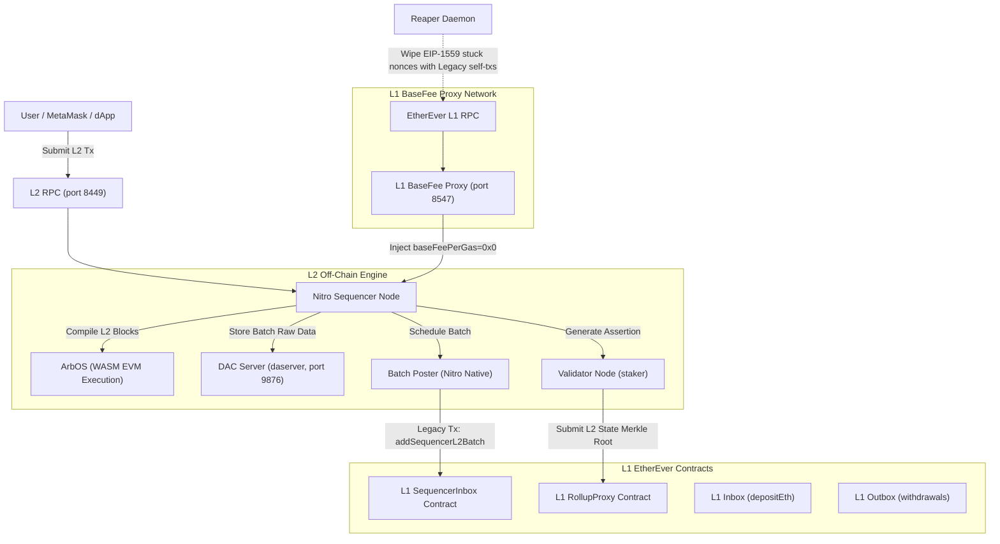

# ArbiEver L2 Engine

> **ArbiEver** is a highly optimized, dedicated L2 engine fork based on the Arbitrum Nitro AnyTrust stack. It is engineered to operate exclusively on top of the **EtherEver L1 custom PoW chain**, bringing high-throughput, sub-second block times (~250ms), and visual explorer support to the EtherEver ecosystem while maintaining the robust security guarantees of Optimistic rollups.

---

## ⛓️ Core Chain Specifications

| Parameter | Parent L1 Chain (EtherEver) | Child L2 Chain (ArbiEver) |
| :--- | :--- | :--- |
| **Chain ID** | `58051` (`0xe2c3`) | `580511` (`0x8db9f`) |
| **Consensus** | Custom PoW (Ethash) | AnyTrust (Arbitrum Nitro, 1-person DAC) |
| **Block Time** | ~13 seconds | ~250ms (dynamic sequencer blocks) |
| **Gas Token** | `ETE` (EtherEver Ether) | `ETE` (Bridged/Minted) |
| **Gas Model** | Legacy (baseFeePerGas hidden in RPC) | Arbitrum Standard (custom baseFee) |
| **EVM Version** | London (custom, no PUSH0 opcode) | Cancun (full EVM compatibility) |
| **RPC Endpoint** | `https://rpc-ether.ever-chain.xyz` | `https://rpc-arbi.ever-chain.xyz` |
| **Explorers** | N/A | **Blockscout**: `https://arbiever.ever-chain.xyz`<br>**Alethio Lite**: `https://arbiever2.ever-chain.xyz` |

---

## 🏗️ System Architecture

ArbiEver coordinates several core off-chain and on-chain actors to securely propagate transactions from L2 down to the L1 chain:



### Transaction Processing Lifecycle

1. **Transaction Submission**: Users interact with the L2 network via MetaMask or web3 clients using `https://rpc-arbi.ever-chain.xyz`.
2. **Block Sequencing**: The Nitro Sequencer immediately schedules the transactions, executing them in milliseconds using ArbOS.
3. **Data Availability (AnyTrust)**: The Sequencer compresses the raw block data (Brotli) and posts it to the local 1-person Data Availability Committee server (`daserver`). The server returns a signed certificate hash.
4. **Batch Posting**: The Batch Poster publishes this certificate hash to the L1 `SequencerInbox` contract. This ensures L2 data availability is securely committed to L1.
5. **State Assertion**: The Validator daemon aggregates L2 states, computes the state Merkle root, and posts an assertion on the L1 `RollupProxy` via their individual `ValidatorWallet` contract (requiring a 1 ETE stake).
6. **Optimistic Settlement**: The assertion enters a 7-day challenge period. If no fraud is proven, the state is finalized, allowing users to withdraw funds back to L1 via the `Outbox` contract.

---

## 🛠️ Core Components

1. **Patched Nitro Sequencer (`nitro`)**: An Arbitrum Nitro node containing a critical source-code patch allowing the Sequencer's Batch Poster and Validator to force the use of legacy (Type-0) EIP-155 transactions, as the custom EtherEver miner rejects EIP-1559 Type-2 transactions.
2. **DAC Server (`daserver`)**: A local AnyTrust Data Availability Committee server that stores raw rollup batches and serves them via an RPC endpoint.
3. **L1 BaseFee Proxy (`l1_proxy.py`)**: Intercepts L1 RPC requests and inserts `baseFeePerGas = 0x0` into block headers, resolving a critical issue where Nitro's gas calculation panics on nil pointers due to EtherEver L1 hiding its baseFee.
4. **Type-2 Stuck Transaction Reaper (`reaper.py`)**: A safety-net daemon that continuously monitors the transaction pool. If any residual EIP-1559 Type-2 transaction from the Batch Poster or Validator gets stuck in the miner pool, it replaces the stuck transaction with a legacy zero-value self-transfer with a higher gas price, freeing the nonce chain.

---

## 🛡️ 8 Resolved Traps

During the L2 bootstrap and deployment, 8 critical traps were identified and resolved to ensure complete compatibility between the Arbitrum Nitro engine and the custom EtherEver L1:

| # | Trap / Issue Encountered | Root Cause | Resolution Applied |
| :--- | :--- | :--- | :--- |
| **1** | **Yul Build Omission** | Foundry's default build profiles do not compile Yul code. | Re-compiled using `FOUNDRY_PROFILE=yul forge build` during contracts prep. |
| **2** | **CREATE2 Factory Deploy Failure** | Pre-signed legacy CREATE2 transactions are rejected due to lack of EIP-155 support. | Manually deployed a custom CREATE2 factory signed directly using L1 deployer keys. |
| **3** | **EIP-1559 Miner Rejection** | The custom EtherEver L1 miners reject Type-2/Type-1 transactions. | Patched Nitro source-code to bypass Type-2 dynamic-fee transactions, forcing standard Legacy transactions. Run the `reaper.py` safety-net daemon. |
| **4** | **BOLD gas limit exceed** | BOLD protocol templates in main Nitro branches exceed EtherEver's block gas limits. | Downgraded and locked the L1 contracts stack to `nitro-contracts v2.1.3`. |
| **5** | **ArbitrumChecker STATICCALL Failure** | EtherEver lacks the custom precompiled contract `ArbSys (0x64)`, burning all execution gas. | Patched `ArbitrumChecker` to return `false` on `runningOnArbitrum()` static calls. |
| **6** | **SequencerInbox InitParamZero** | EIP-4844 binary checks rejected zero addresses. | Patched the `SequencerInbox` contract constructor, removing the else condition that validated `reader4844`. |
| **7** | **deploymentUtils CREATE2 & Gas Limits** | CREATE2 deployments fails on gas estimations. | Configured `useCreate2 = false` and hardcoded L1 deployment `gasLimit = 100000000`. |
| **8** | **PUSH0 Opcode Rejection** | EtherEver EVM targets London, which does not support the Shanghai `PUSH0` instruction. | Configured Solidity compiler targets explicitly to `evmVersion: "london"` in `foundry.toml` and Hardhat configurations. |

---

## 🏗️ Build & Compilation Steps

To compile the custom legacy-compatible Nitro engine binary, follow the instructions below:

### Prerequisite Patches
The custom patches are located in `./nitro-source-patch/`:
- `data_poster_legacy.patch`: Patches `arbnode/dataposter/data_poster.go` to enforce legacy transaction types and map gas calculations correctly.
- `Dockerfile_cbindgen.patch`: Locks `cbindgen` versioning to avoid compilation errors with modern Rust systems.

### Native Compilation of Patched Nitro
```bash
# 1. Clone the Nitro v3.2.1 repository and apply source patches
git clone --recurse-submodules -b v3.2.1-d81324d https://github.com/OffchainLabs/nitro.git
cd nitro
git apply ../nitro-source-patch/data_poster_legacy.patch
git apply ../nitro-source-patch/Dockerfile_cbindgen.patch

# 2. Build WASM Prover stage containers (Taskset to bound core limit and OOMs)
taskset -c 0,1 docker build --target prover-header-builder -t local-prover-h .
taskset -c 0,1 docker build --target prover-builder -t local-prover-b .

# 3. Extract compiled WASM targets
docker run --name temp-prover local-prover-b true
docker cp temp-prover:/workspace/target ./target
docker rm temp-prover

# 4. Native Go Build (Produces the patched nitro engine binary)
go build -o nitro-patched ./cmd/nitro
```

---

## 🚀 Execution & Running Guide

All components can be managed natively via `systemd` or orchestrated within standard docker containers.

### Local Systemd Services (Off-chain Node Stack)

| Service File | Description | Execution Binary / Command |
| :--- | :--- | :--- |
| `arbiever-proxy.service` | L1 baseFee RPC Proxy | `python3 l1_proxy.py 8547` |
| `arbiever-daserver.service` | DAC AnyTrust Storage Server | `./daserver --conf.file das_config.json` |
| `arbiever-nitro.service` | Sequencer, Batch Poster & Validator | `./nitro --conf.file node_config.json` |
| `arbiever-reaper.service` | Stuck transaction cleanup daemon | `python3 reaper.py` |

#### Process Management
```bash
# Start the stack in correct dependency sequence
systemctl start arbiever-proxy
systemctl start arbiever-daserver
systemctl start arbiever-nitro
systemctl start arbiever-reaper

# Track logs
journalctl -u arbiever-nitro -f
tail -f reaper.log
```

### Dockerized Services (Explorers & Data Indexes)
The full visual explorer layer runs in containerized environments:
- **Alethio Lite**: Visual transaction scanner connecting directly to L2 RPC.
- **Blockscout Full Stack**: Includes Postgres, backend parser, and responsive React frontend, providing full address indexing and asset search support.

```bash
# Start blockscout database and visual stack
cd /root/ArbiEver-Blockscout
docker compose --env-file .env up -d

# Start Alethio visual explorer
docker run -d --name arbiever-alethio --restart unless-stopped \
    -p 4002:80 \
    -e APP_NODE_URL="https://rpc-arbi.ever-chain.xyz" \
    silverruler/arbiever-alethio:latest
```

---

## 🛠️ CLI Administration & Verification

Use standard RPC querying and Foundry cast commands to inspect the state of the network.

### L2 Node RPC Diagnostics
```bash
# Check current L2 Block Height
curl -s http://127.0.0.1:8449 -X POST -H "Content-Type: application/json" \
    -d '{"jsonrpc":"2.0","method":"eth_blockNumber","params":[],"id":1}' | jq

# Validate Chain ID returns 0x8db9f (580511)
curl -s http://127.0.0.1:8449 -X POST -H "Content-Type: application/json" \
    -d '{"jsonrpc":"2.0","method":"eth_chainId","params":[],"id":1}' | jq
```

### L1 Contract State Propagation
```bash
export L1_RPC="https://rpc-ether.ever-chain.xyz"
export SEQ_INBOX="0xA5CD2DB4022595Ea6BE7259d6AC7061dA54930f1"
export ROLLUP_PROXY="0x70CA25CeaF5d40cf0ce7E21f540f07817135E977"

# Inspect the total batch counts posted on L1
echo "Total Posted Batches:" $(cast call --rpc-url $L1_RPC $SEQ_INBOX "batchCount()(uint256)")

# Inspect the latest assertion node ID submitted by the Validator
echo "Latest L2 State Node ID:" $(cast call --rpc-url $L1_RPC $ROLLUP_PROXY "latestNodeCreated()(uint64)")
```

### Depositing Funds to L2 (`depositEth`)
```bash
# Send ETE from L1 to L2 using the custom Inbox interface
cast send --rpc-url https://rpc-ether.ever-chain.xyz \
    --private-key <YOUR_L1_PK> \
    --legacy --gas-price 1000000000 \
    --value 5ether \
    0x76b3772769cDD09Fb6A33e5f65fd13256808fc08 "depositEth()"
```
